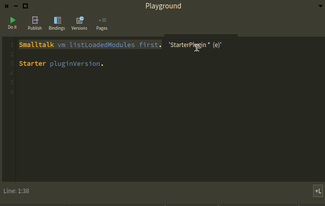

# PharoPluginBuilder
A friendly setup for creating your own Pharo plugins.
_____


You can use a clone of this repository for local development of a Pharo Smalltalk Plugin. With it, you'll be able to:
1. Have a fast start on the setup to start a new plugin from scratch.
2. Use the [pharo-vm](https://github.com/pharo-project/pharo-vm) dependency in an organized and correct way.
3. Use Pharo as IDE for generating the C code of your plugin out of your [Slang](https://github.com/pharo-open-documentation/pharo-wiki/blob/master/General/Glossary.md#slang) code.
4. Have your plugin code versioned in your own separated repo as it should.
5. Generate the binaries of your plugin.
6. Test your plugin binary using the same Pharo image you use as IDE.

## Structure

```
┌─────────────────────────┐                                               
│   PharoPluginBuilder/   │                                               
└┬────────────────────────┘    ┌───────────────────────┐                  
 │     ┌────────────────┐      │For starting a build   │                  
 ├────▶│build.sh        │◀─────┤(once configured).     │                  
 │     └────────────────┘      └───────────────────────┘                  
 │     ┌────────────────┐      ┌─────────────────────────────┐            
 ├────▶│CMakeLists.txt  │◀──┐  │For scripting the            │            
 │     └────────────────┘   └──┤configuration of a build.    │            
 │     ┌────────────────┐      └─────────────────────────────┘            
 ├────▶│configure.sh    │◀──┐  ┌─────────────────────────────────────┐    
 │     └────────────────┘   │  │Command to configure your environment│    
 │     ┌────────────────┐   └──┤(prior to trigger a build).          │    
 ├────▶│dependencies/   │      └─────────────────────────────────────┘    
 │     └─┬──────────────┘                                                 
 │       │  ┌──────────┐           ┌───────────────────┐                  
 │       ├─▶│ builds/  │           │Output dir for the │                  
 │       │  └─┬────────┘         ┌─┤pharo-vm build.    │                  
 │       │    │  ┌─────────────┐ │ └───────────────────┘                  
 │       │    └─▶│  pharo-vm/  │◀┘                                        
 │       │       └─────────────┘  ┌───────────────────────────────┐       
 │       │  ┌─────────────┐       │The Pharo VM (hard requirement │       
 │       └─▶│  pharo-vm/  │◀──────┤for building your plugin).     │       
 │      ... └─────────────┘       └───────────────────────────────┘       
 │       │  ┌────────────────────┐     ┌─────────────────────────────┐    
 │       └─▶│ third-party-lib-X/ │◀─┐  │Any third party lib required │    
 │          └────────────────────┘  └──┤by your plugin.              │    
 │     ┌──────┐                        └─────────────────────────────┘    
 ├────▶│dist/ │                                                           
 │     └─┬────┘                                                           
 │       │  ┌────────┐        ┌──────────────────────────────────┐        
 │       └─▶│ build/ │◀───┐   │Once built, the binaries of your  │        
 │          └────────┘    └───┤plugin, will be here.             │        
 │     ┌────┐                 └──────────────────────────────────┘        
 ├────▶│ide/│◀───────┐        ┌──────────────────────────────────────────┐
 │     └────┘        │        │This is for the Pharo image that you'll be│
 │                   └────────┤using for the Smalltalk Plugin code that  │
 │     ┌─────┐                │generates the C code i.e.: StarterPlugin  │
 └────▶│src/ │                └───────────────────────────────┬──────────┘
       └─┬───┘                                                │           
         │  ┌───────────┐                                     │           
         └─▶│generated/ │                                     │           
            └─┬─────────┘                    Generated using PharoVMMaker.
              │  ┌────┐                      You generate this once as a  
              └─▶│64/ │                      starting point. Then you     
                 └┬───┘                      develop `StarterPlugin.c`    
                  │  ┌─────────┐             further on your own. Either  
                  └─▶│plugins/ │             manually or from Slang       
                     └─┬───────┘             generating new versions, your
                       │  ┌──────┐           call.     │                  
                       └─▶│ src/ │                     │                  
                          └──────┘                     │                  
                               ┌────────────────┐      │                  
                               │ StarterPlugin/ │      │                  
                               └─┬──────────────┘      ▼                  
                                 │  ┌────────────────────┐                
                                 └─▶│  StarterPlugin.c   │                
                                    └────────────────────┘                
```

## Steps
Creating your plugin roughly goes like this:
1. Clone this repo:
```
git clone --recursive git@github.com:sebastianconcept/PharoPluginBuilder.git
```
   
2. Make a directory to sit a Pharo image to use as IDE and install your plugin project in it. You can use [StarterPlugin](https://github.com/sebastianconcept/StarterPlugin) as a seed for it:

```
mkdir ide
```
```
cd ide
```
I'm using Pharo 9 this time:
```
curl get.pharo.org/64/90 | bash
```
```
curl get.pharo.org/64/vm90 | bash
```
Now, we need to load VMMaker (for Pharo `v9.0.21` at this time) and your plugin project in that IDE Pharo image. In this guide, instead of your actual plugin project, we will be using `StarterPlugin`.

Open that Pharo image and in a Playground evaluate:

```smalltalk
Metacello new
  baseline: 'VMMaker';
  repository: 'github://pharo-project/pharo-vm:v9.0.21';
  load.
```

Now the superclass of your plugin was loaded in that image, go ahead and to load `StarterPlugin` evaluate:

```smalltalk
Metacello new
  baseline: 'StarterPlugin';
  repository: 'github://sebastianconcept/StarterPlugin';
  load
```

3. Back to the root directory of `PharoPluginBuilder`, go ahead and configure, in `./dependencies/builds/pharo-vm`, the `pharo-vm` you have in `dependencies/`:
```
cmake -S ./dependencies/pharo-vm -B ./dependencies/builds/pharo-vm
```
4. And build it so you have all the requirements that are **generated**:
```
cd dependencies/builds/pharo-vm; make
```
4. Once the `pharo-vm` build is done, go back to this repo's root and configure the whole project:
```
./configure.sh
```
5. And build it:
```
./build.sh
```
6. Once that build finishes you plugin will be there. You can symlink this brand new lib which is the binary of your plugin:
```
cd ide
ln -s ../dist/build/libStarterPlugin.dylib libStarterPlugin.dylib
```
From the Pharo you have in `ide/`, you will be able to use it.
## Using your StarterPlugin

Your plugin should be lazily loaded by Pharo's VM once you use it.  You can check that with:
```
Smalltalk vm listLoadedModules
```
In `StarterPlugin` I've added the method that returns the harcoded version programmed from Slang:
```
Starter pluginVersion
```
It should look like this:


